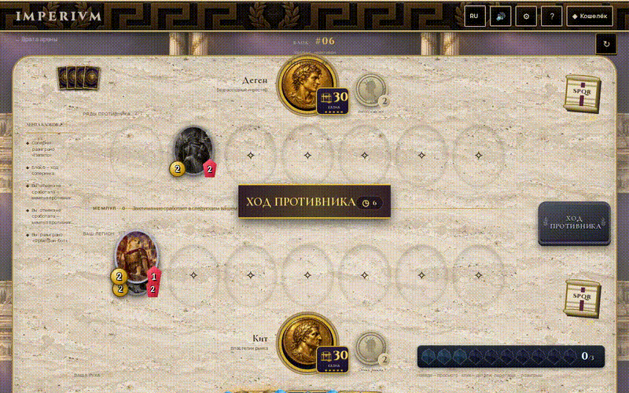
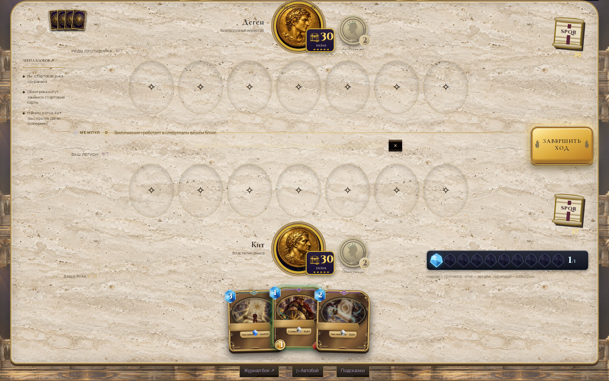
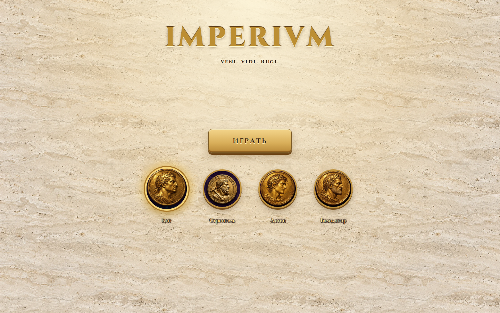
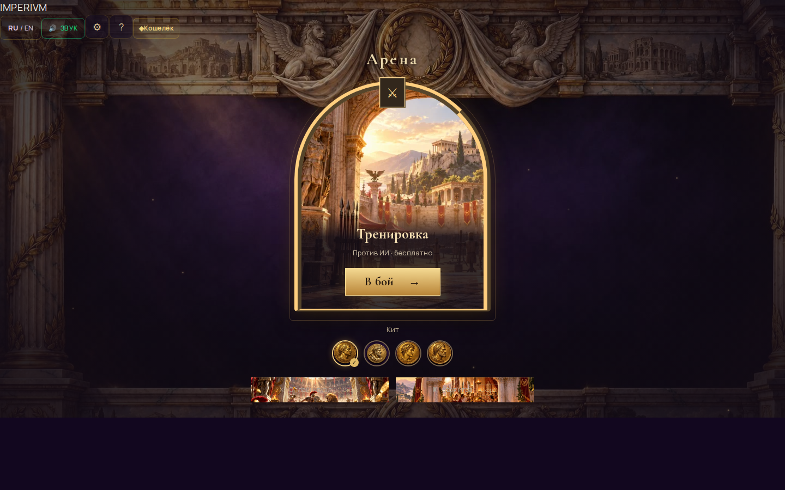

<div align="center">

# 🏛️ IMPERIVM

**Veni. Vidi. Rugi.**

A Hearthstone-style card battler set in imperial Rome — on Solana. Read the mempool. Build your legion. Empty the rival's Treasury.

[](https://imperivm-git-rebirth-adamrogozhin-7410s-projects.vercel.app/)


**49 cards · 4 heroes · No wallet required**

</div>

---

## 🎮 Gameplay



*Real autoplay match — minions clash on the marble battlefield*

---

## ⚔️ The chain is the board

Every turn creates a block. Tactical **instant spells** act immediately; **edicts** wait in a public mempool until your next turn, giving the opponent a response window.

| Mechanic | What it does |
| --- | --- |
| **Mempool** | Cast spells resolve at the start of your next turn, in cast order. Both players see the queue. |
| **Orders / Приказы** | Mana crystals, 1→10. Grows each turn. Staked creatures add gas. |
| **Priority** | Instantly counters the most expensive enemy queued spell. Frontrunning as gameplay. |
| **Staking** | A creature earns +1 gas each turn but cannot attack. Still attackable. |
| **Halving** | Creatures gain +1/+1 at block intervals. Both boards tick. |
| **RUG PULL** | The trap card. Clears both boards on resolution. Hold it long enough — or watch **Audit** cancel it. |
| **Taunt / Rush / Lifesteal** | Protect the Treasury. Strike on summon turn. Heal from combat damage. |

Deck **30** · hand **10** · board **5**, expandable to **7** with Agora Expansion. Treasuries start at **30 HP**. Reduce the rival's to zero.

---

## 🃏 Cards & Heroes

Olympus adds six cards with public preparation and conditional arrival effects. All previous cards remain available. See [design, research and validation](docs/research/olympus-design-20261007.md) and [Omni Flash pack 18–25](docs/olympus-vfx/00-START-HERE.md).

All eight Olympus effects are installed; see the [import and validation report](docs/olympus-vfx/IMPORT-20261008.md). A separate [set of 50 character illustrations](docs/art-direction/generated-characters-50-20261008/README.md) is prepared for a future expansion; its proposed mechanics are not yet playable. Preview the art at `/ui/arena-lab/character-art-50/index.html`.

Deployment contacts now match the card plane and battlefield spacing. All twelve videos from [VFX pack 26–37](docs/arrival-vfx-26-37/00-START-HERE.md) have been imported: seven landings and two ranged impacts are used in battle; three character appearances are reserved for future cards. See the [import report](docs/arrival-vfx-26-37/IMPORT-20261008.md). Preview/download at `/ui/arena-lab/imperivm-arrival-vfx-26-37/index.html`.


Hearthstone-grade card anatomy: blue mana crystal, oval art portrait, gold name ribbon, parchment rules text, gold attack orb, red health drop. Rarity frames from silver to dragon-claw legendary.



*Unified marble battlefield — no blocks, no panels. Just the game.*

### Heroes — the Wallets

| Hero | Title | Power (2 gas) |
| --- | --- | --- |
| 🐋 **Whale** | The Market Mover | *Market Dump* — 2 damage to a random enemy |
| 🔨 **Builder** | The Shipwright | *Deploy Patch* — restore 3 Treasury HP |
| 🚀 **Degen** | The Aped | *Aped In* — draw a card, take 2 damage |
| ⛓️ **Validator** | The Block Keeper | *Validate* — gain 2 gas this turn |



### Arena



*Training and free online 1v1 share the imperial arena. Private rooms and matchmaking use the authoritative WS service; see [server/README.md](server/README.md).*

---

## 🚀 Quick start

**Node.js 20+**

```sh
npm ci
npm run dev
```

Open **http://localhost:3000** — no wallet, no env file, no setup. Pick a hero and play.

```sh
npm run build    # production build
npm start        # serve production
npm run smoke    # full AI match + 61 regression groups
```

---

## 🏗️ Project structure

```text
app/                Routes — landing, arena, game, collection, packs
components/         Cards, board, effects, dialogs, wallet UI
components/3d/      Lazy GLB accents (coins, trophy, column) with 2D fallbacks
lib/engine/         Pure TypeScript game rules — deterministic, tested
lib/solana/         Devnet guards, proof verification, NFT flows
lib/collection/     iDos gateway + local browser fallback
public/             Card art, hero coins, marble battlefields
scripts/            Smoke tests, content validation, regressions
readme/             Screenshots & GIFs for this README
```

---

## 🌐 Demo & chain status

**🎮 [Play the live demo](https://imperivm-git-rebirth-adamrogozhin-7410s-projects.vercel.app/)** — Vercel preview, no login needed.

| Layer | Status |
| --- | --- |
| **Local game** | ✅ Full AI matches, 4 heroes, 41 cards, demo packs, deck builder |
| **Solana** | 🧪 Devnet only. Phantom connect, proof-of-play signatures |
| **NFTs** | 🧪 Metaplex Core collection + Candy Machine coded, not yet live-minted |
| **iDos** | 🧪 Typed adapter ready, no Title created yet |
| **PvP / Mainnet** | 🔜 Future work |

> `$RUG` is a demo currency with no cash value. Not an SPL token.

---

## 📜 License

[MIT](LICENSE) — built for the Crypto World's Fair Hackathon.

<div align="center">

**Veni. Vidi. Rugi.** 🏛️

*The forum will remember.*

</div>
