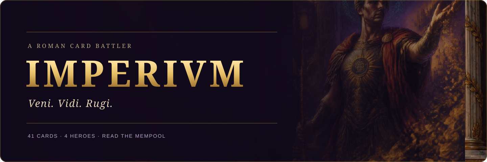
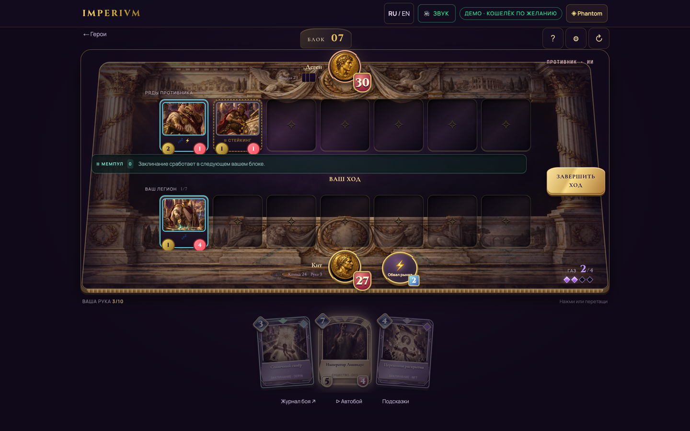
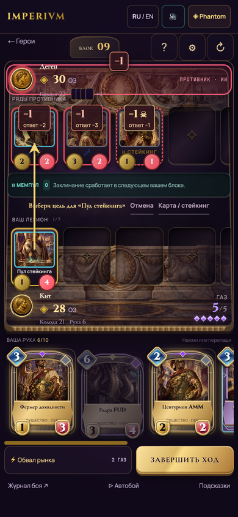
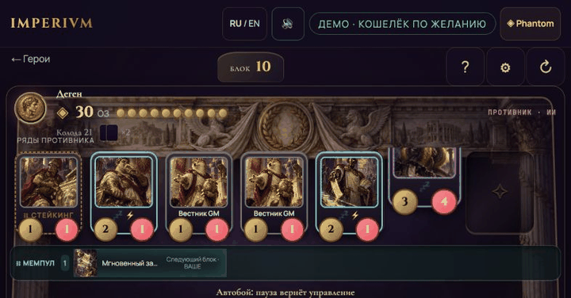
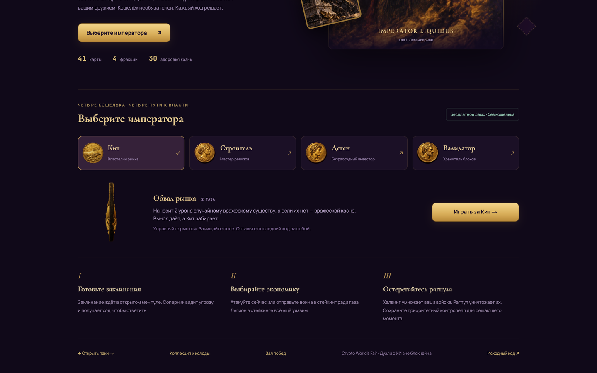

<div align="center">

# IMPERIVM

**Veni. Vidi. Rugi.**

A Roman crypto card battler. Read the mempool. Build your legion. Empty the rival's Treasury.


[](docs/verification.md)


**41 cards · 4 heroes · 3 battlefields · No wallet required**



[Play locally](#play-in-60-seconds) · [Rules](#the-chain-is-the-board) · [Setup](#run-it) · [Evidence](docs/verification.md)

</div>

> Captured from the running production app: desktop **1440 × 900**, mobile emulation **390 × 844**. [Capture ledger](docs/media/README.md).

Every turn creates a block. Spells wait in a public mempool until your next turn, giving your opponent time to counter them. Stake a creature for gas and lose its attack. Hold a RUG PULL long enough to reset the battlefield—or watch an Audit cancel it.

The complete match runs locally against a heuristic AI. Browser collections, demo packs and custom decks accompany it. Optional Phantom and Metaplex flows target **Solana devnet**; live NFT deployment/minting and a configured iDos backend have **not been verified**. There is no live PvP, mainnet game or marketplace trading.

## Play in 60 seconds

1. Run the app, open `/`, choose Whale, Builder, Degen or Validator, and start a match. Russian is the default; **RU / EN** switches languages and remembers your choice.
2. Keep your opening hand or choose cards to replace. Each Treasury starts at **30 HP**.
3. Spend gas on creatures, queued spells or your hero power. Drag a card to the board, or inspect it and choose **Play card**. Select an allied creature, then a glowing target to attack; dragging also works.
4. Choose **End turn**. The AI answers, the next block arrives, and your queued spells resolve at the start of your next turn. Reduce the rival's Treasury to zero.

Use **Autoplay demo** or `/game?hero=whale&demo=1` for an exhibition; it does not earn leaderboard wins or badge eligibility. Arena settings remember your battlefield, language, sound effects, music and animation choices. System reduced motion is honored.

## The chain is the board

| Concept | What it does in a match |
| --- | --- |
| **Gas** | Capacity grows by 1 on each own turn, up to 10. Staked creatures add gas on refill. |
| **Mempool** | A cast spell resolves at the start of its caster's next turn, in cast order. Both players see the queue. |
| **Priority** | Immediately counters the most expensive queued enemy spell; equal costs favor the earliest cast. |
| **Staking** | A creature earns +1 gas each own turn and cannot attack. It remains attackable. Unstaking does not restore an attack that turn. |
| **Halving** | At a creature's indicated block interval, it gains +1/+1. Both boards tick. |
| **RUG PULL / Audit** | RUG PULL clears both boards on resolution. Audit counters immediately, then grants your creatures +1/+1 next own turn. |
| **Taunt / Rush / Lifesteal** | Protect the Treasury; attack creatures on the summon turn; heal from actual combat damage. |
| **Pavilion / Comeback** | A second card of a faction refunds 1 gas once per faction per turn. A sufficiently behind hero gets a 1-gas power. |

Deck **30** · hand **10** · board **7**. Overflow cards burn. Empty-deck draws deal increasing fatigue damage. Hero powers normally cost 2 gas and are usable once per turn. Exact edge cases: [mechanics](docs/mechanics.md) and [engine](lib/engine/engine.ts).

## Inside the empire

- **DeFi, NFT, DePIN and Meme:** the original 40 Genesis cards plus **Audit**, with four preset decks and a custom deck builder.
- **48 manifested illustrations:** 41 cards, four hero portraits and three painted arenas—Marble, Lava and Neon. A separate card back supports hands and pack reveals. [Art provenance](Artifacts/asset-manifest.json) · [Style bible](docs/art-direction/style-bible.md).
- **A real Whale coin:** the supplied GLB is optimized from 30.3 MB to 2.83 MB and loaded lazily, with a static fallback. It is the first available 3D accent; other models remain explicitly unavailable. [Model details](docs/3d-models.md).
- **Distinct card families:** sculpted arches for creatures, crystal tablets for spells and gilded laurels for legendaries. A marble arena, centered hero medallions and a fanned desktop hand keep combat readable.
- **Procedural audio and readable combat:** independent effects/music controls, card inspection, attack feedback, minion staking and localized battle logs.

| Desktop battlefield | Mobile battlefield |
| --- | --- |
|  |  |



<details>
<summary>Whale coin in the application</summary>



</details>

## Run it

**Node.js 20+ and npm.** Local checks use **Node v26.3.0**.

```sh
npm ci
npm run dev
```

Open **http://localhost:3000**. Demo play needs no environment file, wallet or service account.

```sh
npm run build                         # production build
npm start                             # serve the production build
npm run smoke                         # AI match, content checks and regressions
npx --no-install tsc --noEmit          # strict TypeScript check
```

See [verification](docs/verification.md) for focused checks, observed results and outstanding acceptance work.

| Route | Purpose |
| --- | --- |
| `/` | Choose a hero; inspect the Whale 3D coin |
| `/game?hero=whale` | Local match against AI |
| `/collection` | Catalog, browser collection, NFT ownership and deck builder |
| `/packs` | Five-card demo packs; separate devnet NFT-pack flow |
| `/leaderboard` | Local match history and optional First Victory badge |
| `/devnet` | Prepare Genesis collection, Candy Machine and card entries |
| `/api/nft/metadata/[id]`, `/api/nft/owned` | Metadata and configured devnet ownership reads |

## Demo, SDK and chain status

| Layer | Current boundary |
| --- | --- |
| **Local game / collection** | Local AI matches, browser persistence and preset decks. Start with 500 demo `$RUG`; a five-card pack costs 50. `$RUG` has no cash value and is not an SPL token. |
| **iDos Games 0.21.0** | Typed collection/currency adapter is implemented. No Title was created, paid for or live-tested. Missing/placeholder Title ID selects local mode. |
| **Phantom** | Wallet Standard connection, devnet balance and optional verified message signatures. A signature proves wallet participation off chain, not an authoritative match result. |
| **Genesis NFTs** | Metaplex Core collection + free Core Candy Machine flow for the original 40 cards, one NFT per card in this edition. Audit is a gameplay addition outside that mint set. Transaction preview, simulation and wallet approval are coded; a live deployment and mint remain unverified. |
| **First Victory badge** | Core NFT create/update flow for self-reported signed AI victories. Local wins are not an anti-cheat proof. No live badge mint has been verified. |

For integrations, copy `.env.example` to `.env.local`, replace only the IDs you actually configure, and restart/rebuild:

| Environment | Use |
| --- | --- |
| `NEXT_PUBLIC_IDOS_TITLE_ID` | A real configured iDos Title; leave absent/placeholder for the local demo |
| `NEXT_PUBLIC_IDOS_COLLECTION_ID`, `NEXT_PUBLIC_IDOS_PACK_TYPE_ID`, `NEXT_PUBLIC_IDOS_CURRENCY_ID`, `NEXT_PUBLIC_IDOS_PRICE_OPTION_ID` | iDos entity IDs; defaults are in `.env.example` |
| `NEXT_PUBLIC_IDOS_LEADERBOARD_ID` | Optional future SDK leaderboard configuration |
| `NEXT_PUBLIC_NFT_METADATA_BASE_URL` | Actual public HTTPS origin serving metadata and artwork; localhost/placeholders are rejected |
| `NEXT_PUBLIC_GENESIS_COLLECTION`, `NEXT_PUBLIC_GENESIS_CANDY_MACHINE` | Confirmed devnet account addresses after deployment |
| `HELIUS_DEVNET_API_KEY` | Optional server-only indexer credential; never use a `NEXT_PUBLIC_` prefix |

Devnet transactions use test SOL for account rent and fees and require explicit Phantom approval. No private key or seed phrase is requested. [Integration guide](docs/integrations.md) · [Deployment acceptance steps](docs/verification.md#live-integration-acceptance).

## Built with

Versions below come from the checked-in lockfile: Next.js **14.2.35**, React **18.3.1**, TypeScript **5.9.3**, Tailwind **3.4.19**, Solana Kit **8.4.0**, Metaplex Core **1.10.0**, Core Candy Machine **0.3.0**, iDos **0.21.0**, React Three Fiber **8.18.0**, Drei **9.122.0**, Three **0.170.0** and Motion **14.0.0**.

The game engine is pure TypeScript in `lib/engine/`; UI, artwork, sound and wallet flows sit around it. [Game design](GAME_DESIGN.md) records the project's direction; current [mechanics](docs/mechanics.md) and source take precedence over older design proposals.

## Project map

```text
app/                Routes, responsive arena styles, metadata and ownership API
components/         Cards, board slots, effects, dialogs, localization and wallet UI
components/3d/      Lazy local GLB accents and static fallbacks
lib/engine/         Deterministic pure TypeScript rules and additive contracts
lib/solana/         Devnet guards, proof verification, Genesis and badge transactions
lib/collection/     iDos gateway and atomic browser collection fallback
public/             Card art, hero coins, battlefields and optimized Whale model
docs/               Mechanics, integration setup, captures and verification
scripts/            Smoke, content validation and focused regression checks
```

## Roadmap

- Verify the complete devnet wallet → pack → NFT → playable card journey with public metadata and approved wallet transactions.
- Configure an iDos Title when the owner chooses to create one; exercise the existing SDK path against its backend.
- Run human balance sessions; add more supplied hero/trophy/chest models.
- Explore authoritative multiplayer and broader Genesis editions. Mainnet, live PvP, payouts and marketplace trading are future work.

Competition eligibility and event deadlines are not asserted by this README.

[MIT license](LICENSE).
