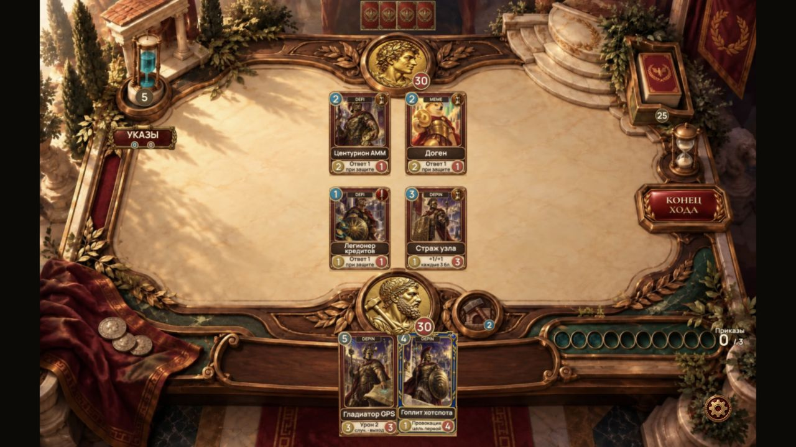
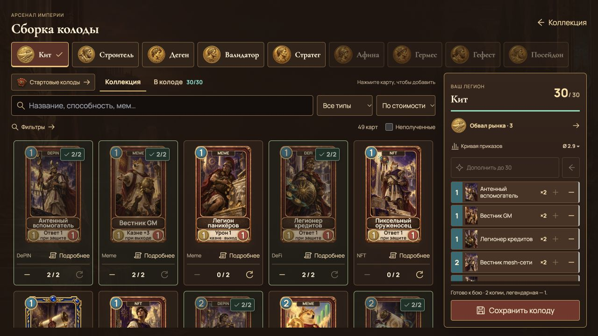
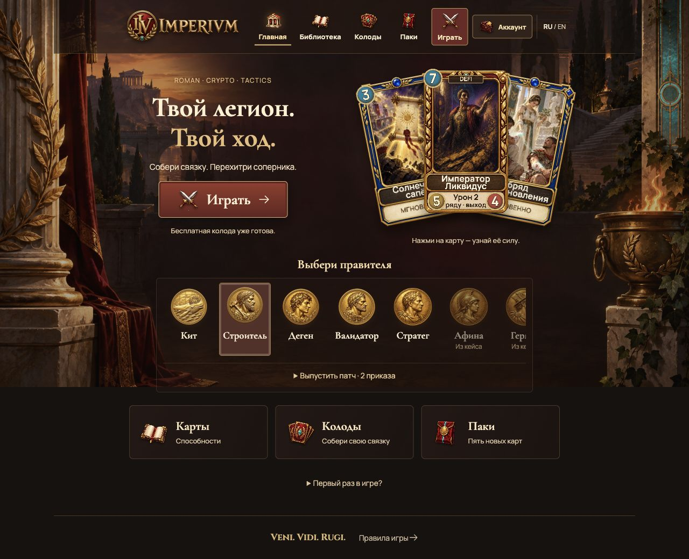
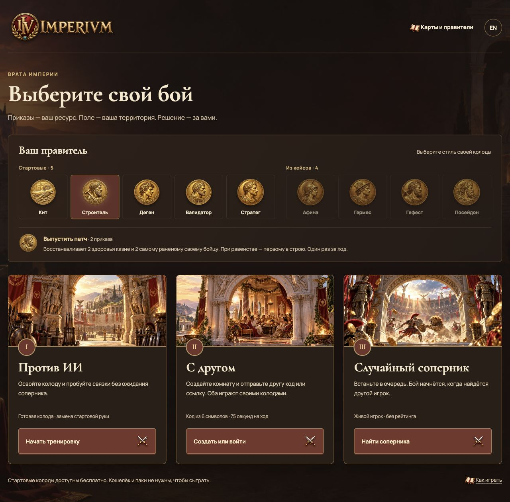
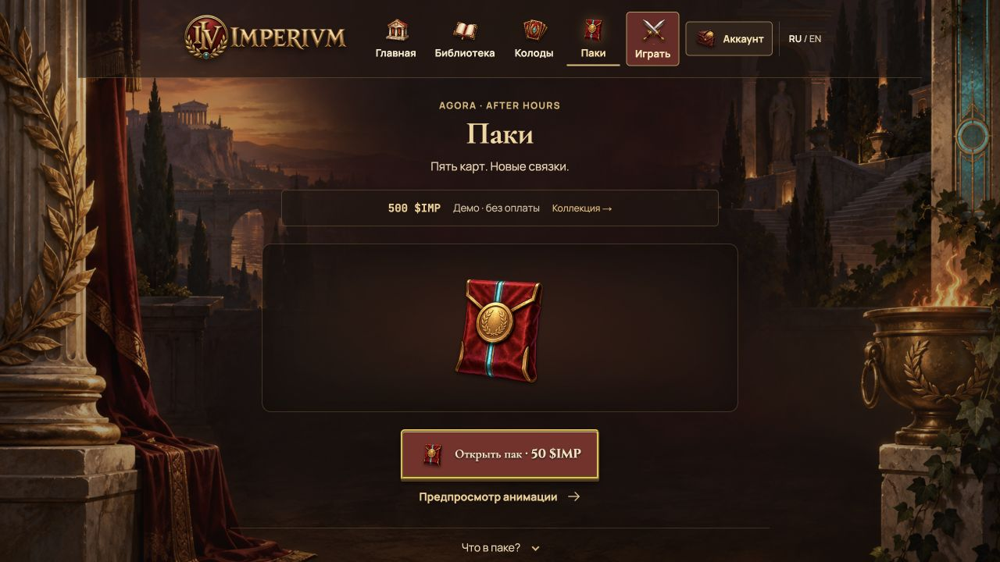

<div align="center">

# 🏛️ IMPERIVM

**Veni. Vidi. Rugi.**

A Hearthstone-style card battler set in imperial Rome — on Solana. Read the mempool. Build your legion. Empty the rival's Treasury.

[](https://imperivm.onrender.com)
[](https://colosseum.org)


**99 cards · 9 rulers (5 free / 4 from cases) · No wallet required for training**

</div>

---

## 🎮 Current arena



*The current Babylon.js arena in a real training match, captured on 9 October 2026. The main branch contains this interface.*

[Play](https://imperivm.onrender.com/arena) · [Build a deck](https://imperivm.onrender.com/collection) · [Open demo packs](https://imperivm.onrender.com/packs)

---

## ⚔️ The chain is the board

Every turn advances a local game block. Tactical **instant spells** act immediately; **edicts** wait in a public mempool until your next turn, giving the opponent a response window. These are game rules; turns do not submit Solana transactions.

| Mechanic | What it does |
| --- | --- |
| **Mempool** | Cast spells resolve at the start of your next turn, in cast order. Both players see the queue. |
| **Orders / Приказы** | Mana crystals, 1→10. Grows each turn. Staked creatures add gas. |
| **Priority** | Instantly counters the most expensive enemy queued spell. Frontrunning as gameplay. |
| **Staking** | A creature earns +1 gas each turn but cannot attack. Still attackable. |
| **Halving** | Creatures gain +1/+1 at block intervals. Both boards tick. |
| **RUG PULL** | The trap card. Clears both boards on resolution. Hold it long enough — or watch **Audit** cancel it. |
| **Taunt / Rush / Lifesteal** | Protect the Treasury. Strike on summon turn. Heal from combat damage. |

Deck **30** · hand **10** · board **5**, expandable to **7** with Agora Expansion. Treasuries start at **30 HP**. Reduce the rival's to zero.

---

## 🃏 Cards & Heroes

Olympus adds six cards with public preparation and conditional arrival effects. All previous cards remain available. See [design, research and validation](docs/research/olympus-design-20261007.md) and [Omni Flash pack 18–25](docs/olympus-vfx/00-START-HERE.md).

All eight Olympus effects are installed; see the [import and validation report](docs/olympus-vfx/IMPORT-20261008.md). The [Agora After Hours expansion](docs/character-expansion-20261008.md) adds 50 pack-exclusive characters with immediate arrival abilities and conditional synergies. Everyone receives 49 free base cards and legal 30-card starters for all nine rulers; expansion deck recipes unlock as cards are collected. Inspect their cards and build decks at `/collection` → **New characters**. Original 49 cards and the separate Genesis NFT manifest are preserved.

Deployment uses rigid card motion and contact effects aligned with the court. Legendary landings add temporary ground cracks and a bounded camera shake. The earlier [VFX pack 26–37](docs/arrival-vfx-26-37/00-START-HERE.md) remains available for reference; its import report describes the earlier implementation. See the [current arena implementation](docs/design/arena-refresh-20261009/README.md).


Cards use painted rarity frames, large character art, a name plate, attack/health medallions and a compact ability hint. On the court, drawn status badges distinguish fresh, ready, spent and garrisoned fighters. Inspect a card to read its full rules.

### Deck workshop



*Owned-card filters, search, starter recipes, a persistent deck list, cost curve and copy limits. Save a legal 30-card deck for the selected ruler.*

### Heroes — the Wallets

| Ruler | Access | Orders | Power |
| --- | --- | --- | --- |
| **Whale** | Free | 3 | 2 damage to a random enemy fighter, or the rival Treasury if its board is empty. |
| **Builder** | Free | 2 | Heal Treasury 2 and the most wounded friendly fighter 2. Requires useful healing. |
| **Degen** | Free | 2 | Draw 1, take 2 damage. |
| **Validator** | Free | 1 | Reserve 2 orders for the start of the next own turn, above capacity. |
| **Strategist** | Free | 2 | Summon a fresh Pixel Squire 1/1 in an empty slot; no arrival effect. |
| **Athena** | Case | 3 | Lowest-health ally gets +1/+1 and Taunt; +1/+2 with another established NFT ally. |
| **Hermes** | Case | 2 | Draw 1, take 3 damage; no damage after playing a DePIN card this turn. |
| **Hephaestus** | Case | 3 | Summon a Legionnaire 2/2, or 3/3 with an established staked ally. |
| **Poseidon** | Case | 4 | Damage all enemy fighters 1, or 2 after two DeFi plays this turn. |

All powers are once per turn. All rulers start at 30 HP with the same formation limit. Tied targets use formation order. The second player receives one temporary extra order in their first turn; it does not increase capacity. Existing saved decks and all 99 card definitions are preserved.

Phone battles use **landscape**: full-width scenery, portrait court tiles with attack/health and readiness, and larger hand cards. Tap to inspect full rules, tap a ready fighter then a target, or drag. In portrait the rotation prompt covers the battlefield. `/arena-lab/embed-preview` provides a real 1280px iframe harness; `?screen=phone` uses 844×390.

See [implementation, measurements and remaining limits](docs/design/arena-refresh-20261009/README.md). The [Flow loading-background kit](public/ui/loading/imperivm-arena-loading-flow.zip) contains START/END/PROMPT. Preview at `/arena-lab/loading-preview`.

### Main menu



### Arena



*Training and free online 1v1 share the imperial arena. Private rooms and matchmaking use the authoritative WS service; see [server/README.md](server/README.md).*

### Packs



*Five cards per pack, one-at-a-time reveals and separate ruler cases. This capture shows the free local demo, with payments disabled.*

Screenshot sources and capture details are recorded in [the current media ledger](readme/current/README.md). Earlier interface captures are kept in the [historical archive](readme/archive-20261004/README.md).

---

## 🏛️ Colosseum submission

Built for the **Crypto World's Fair Hackathon** (Colosseum, 2026), targeting the **Superteam Kazakhstan × iDos Games** side track. Submission and eligibility acceptance are not yet verified. The separate general KZ track has its own registration requirements.

See the [hackathon preparation packet](docs/hackathon-20261009/README.md) for application copy, recording scripts, the current-interface deck and remaining iDos/mainnet checks.

| Name | Role | Contact |
|------|------|---------|
| Rollan Rogozhin | Founder & Developer | [GitHub](https://github.com/Rrollan) |

---

## 🚀 Quick start

**Node.js 20+**

```sh
npm ci
npm run dev
```

Open **http://localhost:3000** — no wallet, no env file, no setup. Pick a hero and play.

```sh
npm run build    # production build
npm start        # serve production
npm run smoke    # full AI match, 256 regression groups and presentation checks
```

---

## 🏗️ Project structure

```text
app/                Routes — landing, arena, game, collection, packs
components/         Cards, board, effects, dialogs, wallet UI
components/3d/      Lazy GLB accents (coins, trophy, column) with 2D fallbacks
lib/engine/         Pure TypeScript game rules — deterministic, tested
lib/solana/         Devnet guards, proof verification, NFT flows
lib/collection/     iDos gateway + local browser fallback
public/             Card art, hero coins, marble battlefields
scripts/            Smoke tests, content validation, regressions
readme/             Screenshots & GIFs for this README
```

---

## 🌐 Demo & chain status

**🎮 [Play the live demo](https://imperivm.onrender.com)** — no login needed. Online 1v1 via `wss://imperivm-ws.onrender.com`.

| Layer | Status |
| --- | --- |
| **Local game** | ✅ Full AI matches, 9 rulers, 99 cards, demo packs, owned deck builder |
| **Solana** | 🧪 Devnet only. Phantom connect, proof-of-play signatures |
| **NFTs** | 🧪 Metaplex Core collection + Candy Machine coded, not yet live-minted |
| **iDos** | 🧪 Title SI4IPS8B configured; current game uploaded as a staged test build, not deployed |
| **PvP** | ✅ Authoritative free online 1v1; paid entitlements require configured iDos |
| **Mainnet checkout** | 🧪 SPL IMP mint verified; purchases blocked until iDos corrects Main decimals from 0 to 6 |

> Local demo IMP has no cash value. Live $IMP is the verified Solana mainnet SPL token bound to iDos `Main`. The current arena is available in an iDos test build; real purchases are blocked by a platform decimals mismatch and wallet/payment testing is pending. See the [current iDos setup and test link](docs/idos/SI4IPS8B-integration.md) and [contest checklist](docs/hackathon-20261009/README.md).

---

## 📜 License

[MIT](LICENSE) — built for the Crypto World's Fair Hackathon.

<div align="center">

**Veni. Vidi. Rugi.** 🏛️

*The forum will remember.*

</div>
