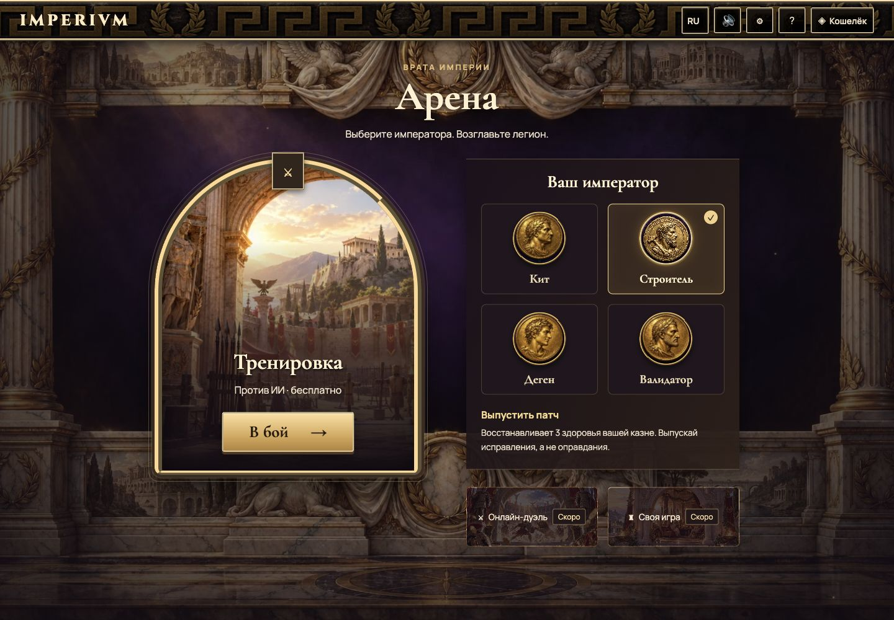
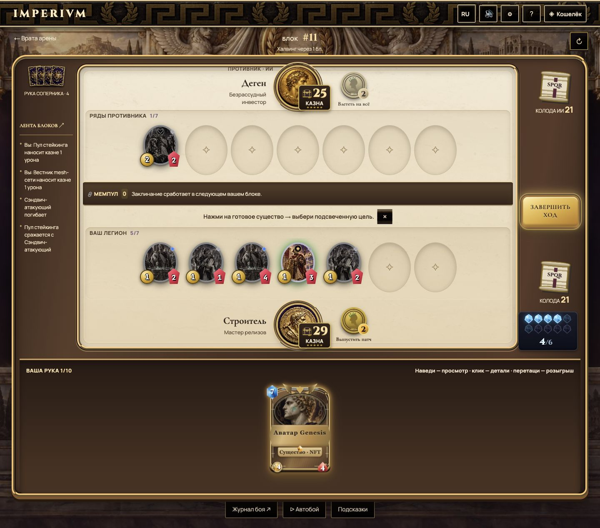

# Критический аудит дизайна IMPERIVM

> Обновление 5 октября: пользователь отклонил результат этого CSS-прохода как основу финальной игры. Основной UI/UX-референс — игровой Hearthstone, сеттинг остаётся собственным. [Глубокий аудит и план пересборки на браузерном движке](rendering-rebuild.md) заменяют дальнейшее наращивание CSS-оформления. В частности, вертикальная прокрутка между рукой и полем не принимается как целевой игровой UX.

4 октября 2026 · ветка `rebirth` · исходный коммит `e23e7f8`.

Проверены [развёрнутый IMPERIVM](https://imperivm-git-rebirth-adamrogozhin-7410s-projects.vercel.app/), локальная версия, исходники и [официальный сайт Hearthstone](https://hearthstone.blizzard.com/ru-ru). Сайт HS использован как визуальный референс типографики, композиции и материалов; игровой клиент HS в этой проверке не запускался.

## Почему результат уступал референсу

| Причина | Конкретный дефект | Исправление |
| --- | --- | --- |
| Слабая иерархия текста | В `globals.css` и `arena.css` подписи уменьшались до 6–10 px. Светлые надписи попадали на светлый камень, мелкие названия терялись среди орнаментов. У HS крупные заголовки и спокойные поверхности под текстом. | Основной текст 14–16 px, управляющие подписи преимущественно 12–14 px, имена героев 20–24 px, правила в подробной карте 16 px. Тёмные чернила на камне, светлые надписи на тёмных панелях. |
| Реальная потеря названий карт | В `CardView` у таблички имени остался один дочерний элемент. Старое правило `.hand-zone .imperial-card .card-name > div:last-child { display: none; }` скрывало именно его. Это был дефект каскада, а не только размер шрифта. | В новом слое оформления восстановлен `display: block` для имени; размер в руке 14 px, в подробном просмотре 19 px. Защищённые исходники карты не изменены. |
| Повторяющаяся архитектура | `scene.css` задавал `background-size: 512px` без запрета повторения. Иллюстрация с колоннами и фризом использовалась как бесшовная текстура. | Одна иллюстрация на сцену: `cover`, `center top`, `no-repeat`, затемнение для текста. |
| Монолит вместо арены | Поздний слой `scene.css` отключал оба псевдоэлемента поля через `content: none`. Стол, ряды, мемпул и рука получали одну мраморную поверхность. Силуэт не объяснял глубину и назначение частей. | Поднятый деревянный корпус, бронзовая кромка со ступенями и внешней тенью, утопленный светлый пол с внутренней тенью, углубления рядов и слотов, отдельные тёмные мемпул и полка руки. |
| Нестабильные портреты | Маленькие изображения без постоянных подписей затрудняли выбор. Новый портрет Строителя имеет формат 1920×1280, остальные изображения квадратные: одинаковое растягивание не подходит. При сбое загрузки оставалась пустота. | Общий `HeroArt`: круглый viewport, пропорциональный `object-fit: cover`, отдельный crop Строителя и fallback с инициалом. На `/arena` все четыре героя с именами и описанием выбранной способности. Серверный арт Строителя сохранён. |
| Перегруженный каскад | Несколько глобальных слоёв по очереди меняли материалы, контраст, размеры и фоны всех кнопок. Например, выбор героя наследовал текстуру таблички. | Изолированный завершающий слой `design-polish.css`, отдельный CSS-модуль ворот, явные правила для функциональных зон и состояний. |
| Недоработанные малые размеры | Кристаллы выходили за боковой борт, отметка «ОСТАВИТЬ» закрывала характеристики карты. Невидимые tooltip расширяли коллекцию; ряд редкостей расширял страницу паков. | Мана на десктопе в двух рядах по пять, на телефоне в своей полосе. Отметка замены вынесена под карту. Скрытые tooltip исключены из раскладки, подписи редкостей переносятся. |

## Изменённая композиция

На `/arena` одна архитектурная сцена объединяет светящийся портал тренировки и панель выбора императора. Активный герой отмечен рамкой и галочкой; способность видна до входа в бой. Ссылка сохраняет выбранный `hero`.

На `/game` дерево, бронза и камень теперь выполняют разные роли. Светлый центр предназначен для существ и чисел, тёмные борта — для колод и истории, нижняя полка — для руки. Декоративная текстура приглушена под текстом. Подсветка допустимых целей, игровые состояния и логика боя сохранены.

Цена читаемости на телефоне — вертикальная прокрутка матча. Узкий заполненный ряд существ использует собственную горизонтальную прокрутку. Поле не масштабируется целиком до нечитаемых размеров.

## Проверки

- Browser QA: `/`, `/arena`, `/game`, `/collection`, `/packs`, `/leaderboard`; ширины 320, 390, 1024 и 1440 px использованы для соответствующих мобильных, планшетных и настольных сценариев.
- На 320 px у проверенных страниц нет горизонтального переполнения документа. На 390 px проверен бой с существами, казной, маной и рукой; на 1024 px — боковой борт; на 1440 px — полная композиция.
- Все четыре портрета загружаются. Строитель выбран на воротах и передан в `/game?hero=builder`.
- Проверены стартовая рука, видимость названий, подробный просмотр карты, автобой с заполненным рядом, настройки и RU/EN на узком экране.
- `npm run smoke`: `SMOKE OK`, проверки контента и **61 regression groups passed**.
- `npm run build`: успешно, exit 0; компиляция, проверка типов и генерация всех маршрутов прошли.
- `git diff --check`: успешно.

## Границы и следующий художественный шаг

Функциональные дефекты исправлены, но равенство с уровнем HS не заявляется. Объём здесь построен слоями DOM/CSS. Полноценная пространственная сцена требует согласованных материалов, единого направления света, собственных предметов окружения и их реакции на игру. В наборе арта по-прежнему смешаны чеканные портреты, живописные иллюстрации и разные способы изображения рамок. Следующий этап — единый художественный проход по окружению и портретам, затем свет и интерактивные детали сцены.

Работа выполнялась в отдельном checkout. `README.md`, `components/CardView.tsx`, `app/card-frames.css`, `components/ManaCrystals.tsx`, серверные маршруты и игровой движок не изменены.
