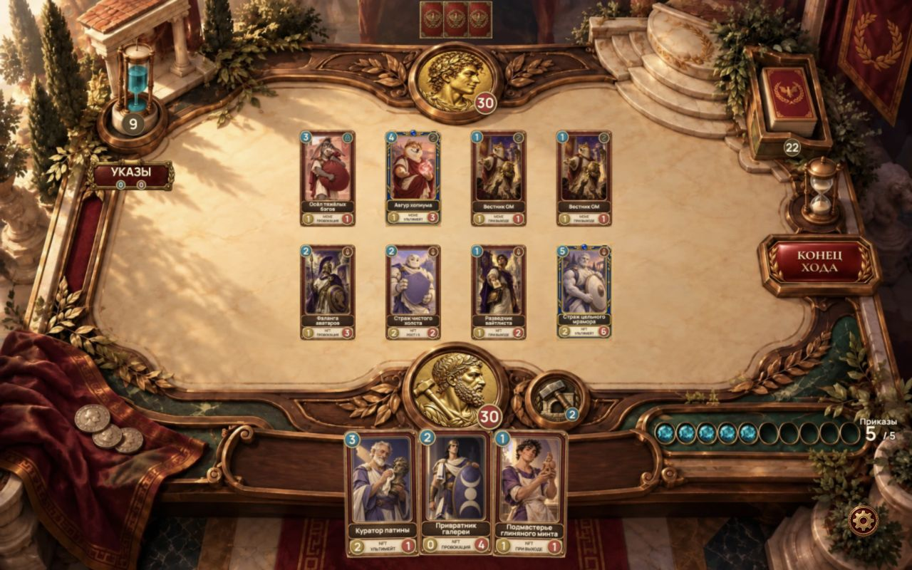
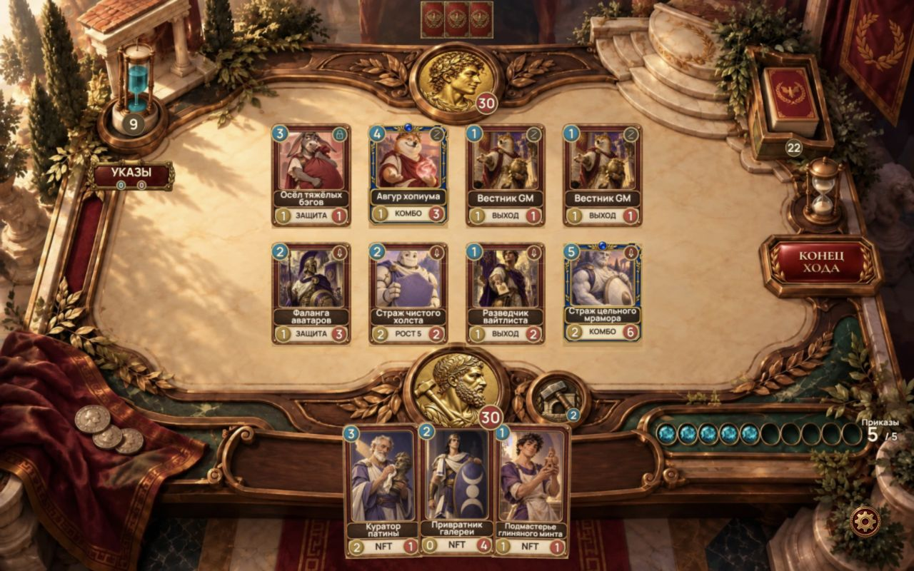
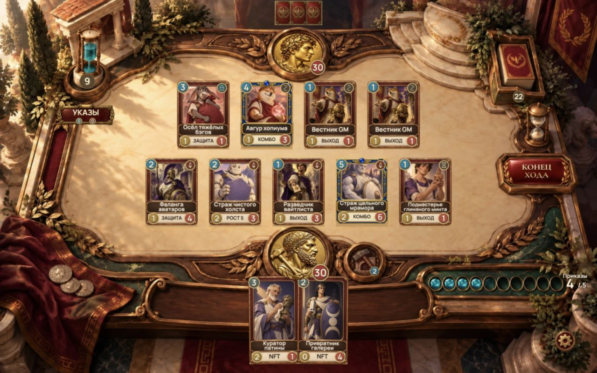
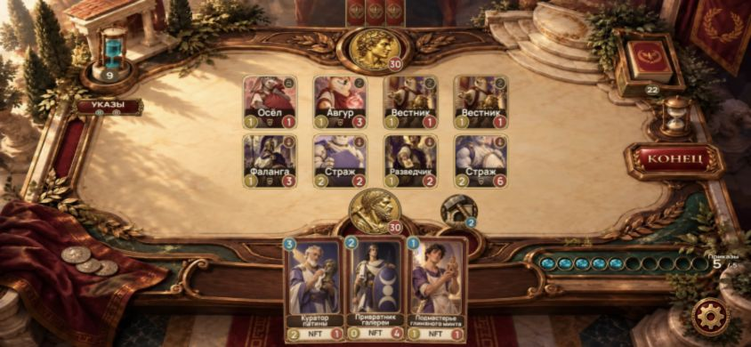
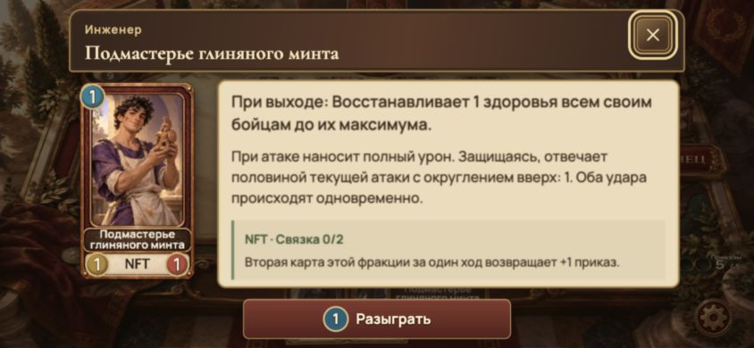
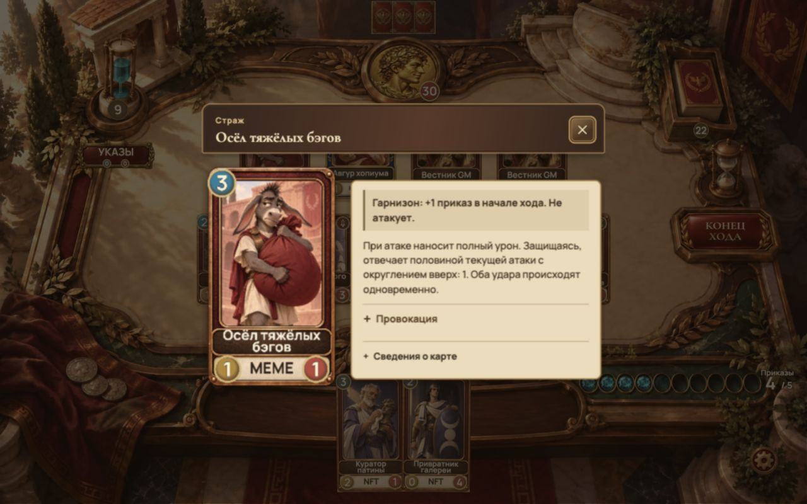
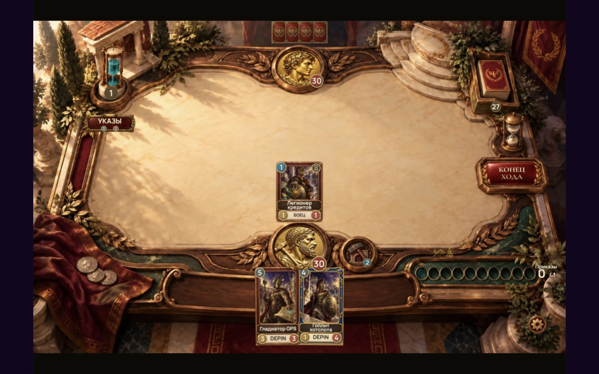

# Arena legibility — 9 October 2026

The arena was drawing 384×672 card faces onto 102px-wide battlefield pieces. At the 1280px iframe limit their names were typically 7–9 CSS pixels tall. Retina auto rendering was additionally capped at 1.5× and a 2.2M-pixel framebuffer. Enlarging only the background would not solve the reading problem.

## Presentation changes

- Normal battlefield pieces are now 146×194.7 logical board pixels, 43% wider than before. Seven-piece formations use 132px; larger diagnostic formations use 100px. Formation spacing, ruler sockets and targeting share one layout.
- The 3:4 battlefield face uses an upper portrait crop. Three vertical frame slices preserve the original rarity gem, nameplate, stat circles and corners. The full portrait card remains in the hand, inspection and public reveal.
- Names use 44px source type, with two-line fitting for longer names. Battlefield footers show one large ability cue. Hand and inspection footers retain a large faction label for link planning. Full ability descriptions remain in the inspection panel.
- Visible card/hero/power faces use 2× texture canvases: 768×1344 for hand cards, 768×1024 for court pieces and 768×768 for medallions. Source illustrations are unchanged. Inspection canvases also use 2× resolution.
- Auto keeps native 2× rendering for typical 1280×800 and 1440×900 Retina hosts. Auto/sharp retain 5.5M/9M pixel budgets; fast retains 1× rendering.
- Hand cards are slightly larger, with their fan kept inside the bottom edge. Mobile pieces show a larger short name cue rather than compressed microtext. Tap opens the full name, original art and readable rules.
- Minion flights keep the full hand card rigid. The shorter battlefield face takes over at contact. The existing aim/effect preview now uses the same dimensions and resolution policy.

Both AI and online boards import the same renderer and texture painter. No changes to engine, balance, networking, economy, card definitions, original image files, CardView, card-frames.css or ManaCrystals.

## Verification

- `npm run build`: final build passed without warnings, including strict type checking and all 21 static pages. A full local disk had caused an optional cache-write warning on an earlier run; only the reproducible `.next/cache` was removed. Production startup is verified separately.
- `npm run test:integrations`: includes the new rarity/frame/viewport/Retina regression checks, plus deck, iDos, ruler, native arrival and aim tests.
- `node --import tsx scripts/presentation-check.ts`: four complete engine-equivalent matches, presentation contact/cancellation and legality.
- `node --import tsx scripts/queue-presentation-check.ts`: queue overflow, outcome timing and formation clearance.
- `node --import tsx scripts/combat-presentation-check.ts`: 3548 legal actions, 1135 contacts, exact engine outcomes.
- `node --import tsx scripts/deployment-geometry-check.ts`: 20 arrival layouts, both players, mobile and desktop.
- `server/npm test`: 12 tests passed, including a complete match, illegal-move rejection, 10-second reconnection and turn expiry.
- Browser: production startup on port 3101 with no browser errors; 1280×800 arena, five fighters after a legal play, drag attack, turn completion, AI reply and draw; 844×390 landscape arena and readable inspection with a successful play. A real 1280×900 child iframe inside a 1440×900 parent was checked through mulligan and drag play. The in-app browser runs at DPR 1; DPR 2 framebuffer policy is covered by regression tests, not a physical-phone claim.

## Visual evidence

Same seeded encounter at the same 1280×800 viewport:

Five-fighter row after a legal card play:

Landscape phone layout and inspection:

Desktop full-art inspection:

Real iframe host:

