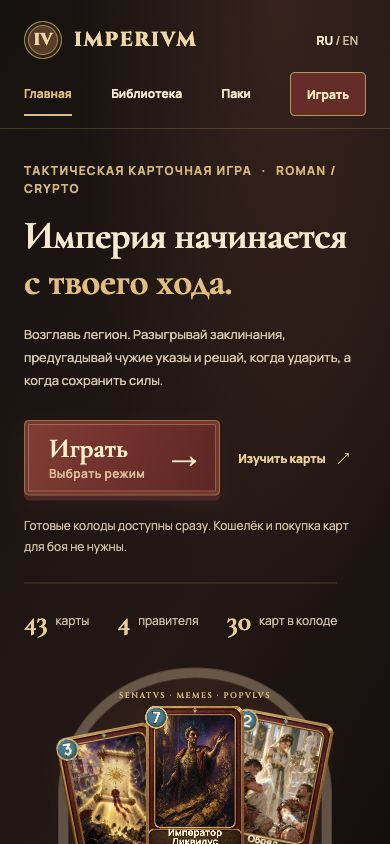
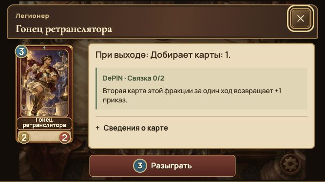
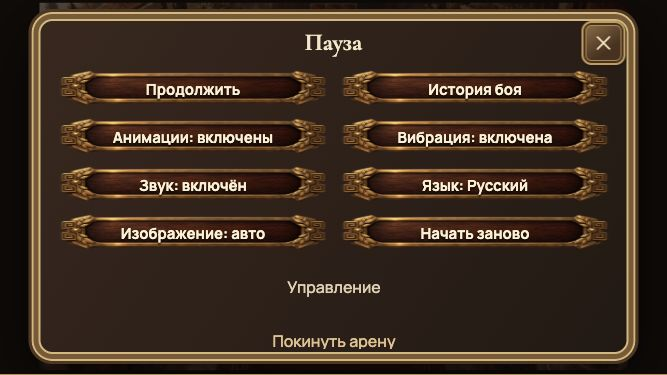
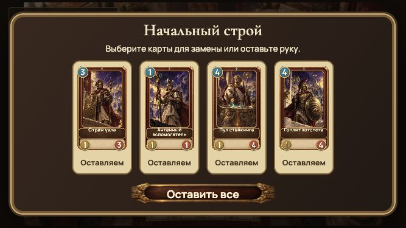
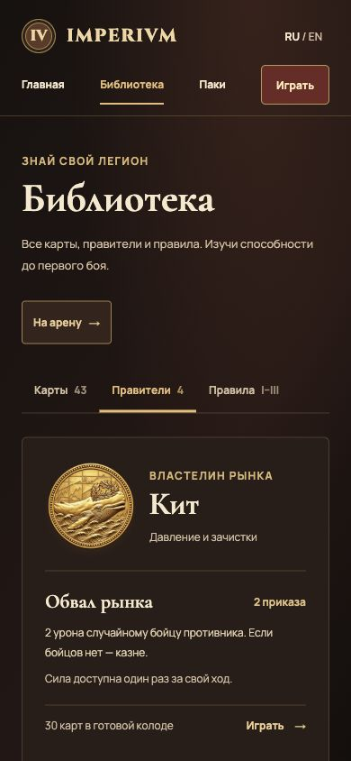
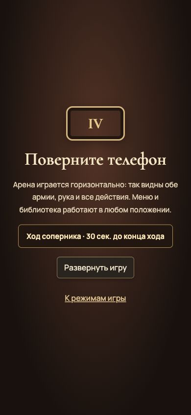

# Интерфейс и мобильный бой — 7 октября 2026

Ветка `rebirth`. Проверена production-сборка на `127.0.0.1:3101`; онлайн-сервер — `3102`.

## Результат

Меню главного зала, библиотеки, коллекции, паков и выбора режимов используют спокойные тёмные панели, светлый текст и бордовые действия. Родные иллюстрации карт и медальоны сохранены. Меню обоих игровых столов используют одну систему оформления.

Внутренние пазы правителей, силы и конца хода привязаны к исходной доске 1586×992. Для небольших действий увеличены невидимые зоны касания до 44 CSS px. Магическая атака жреца/министра и болт инженера используют реальные позиции фигур и момент контакта; обычный боец сохраняет ближний удар. Звук попадания выбирается по этому же профилю и не дублируется общим звуком урона.

Бой рассчитан на горизонтальное положение телефона. В вертикальном положении показана подсказка поворота, в онлайне — также статус и серверный таймер. Каталог и остальные меню доступны вертикально. На небольшой высоте настройки расположены в две колонки, карта полностью вписывается в высоту, описание прокручивается отдельно, действие остаётся снизу. Стартовый выбор размещает три или четыре карты в один ряд.

## Проверки

| Проверка | Результат |
|---|---|
| `npm run build` | Компиляция, TypeScript и все страницы успешно собраны после последней правки |
| `node --import tsx scripts/tests/audio.test.ts` | 20 сигналов; запуск после жеста, mute и настройки |
| `node --import tsx scripts/combat-presentation-check.ts` | 12 полных матчей, 1249 легальных действий, 297 атак; три профиля, ровно один звук оружия, исходы совпадают с движком |
| `scripts/presentation-check.ts` | Четыре полных матча, контакт, отмена, блокировка ввода, перезапуск |
| `scripts/arena-card-matrix.ts` | 43 карты, 76 переходов, 104 визуальных сигнала |
| `scripts/arena-actions-check.ts` | 31 переход: розыгрыш, атака, четыре силы, очередь и другие действия |
| `scripts/instant-spells-check.ts`, `scripts/direct-play-check.ts`, `scripts/queue-presentation-check.ts` | Мгновенные эффекты, цели, комбинированная очередь и reduced motion прошли |
| `npm test` в `server/` | 10 тестов, включая полный матч, отказ нелегальному действию, реконнект после 10 секунд и таймер 75 секунд |
| `git diff --check` | Без ошибок |

## Ручная проверка в браузере

Размеры игрового viewport проверялись внутри отдельного адаптивного контейнера: **667×375**, **844×390** и **390×844**, также обычный большой экран. Это проверка браузерной адаптации, а не испытание физических телефонов.

- На 390 px: главная и навигация, коллекция и рассмотрение карты, разделы библиотеки «Правители» и «Правила», открытие локального демо-пака, выбор режима. `scrollWidth` совпадает с шириной viewport.
- В горизонтальном бою: рассмотрение и раскрытие сведений, розыгрыш карты с добором, сила Строителя, окончание хода и ход ИИ; настройки и нижние действия доступны. После найденного обрезания карта измерена повторно: вся её поверхность находится внутри области просмотра, сама область не переполняется по высоте.
- Онлайн, два отдельных клиента: создание и вход по коду, замена стартовой руки, восстановление комнаты после перезагрузки, розыгрыш Догена и Вестника GM, передача хода, выбор цели и атака жрецом. Казна соперника изменилась **30 → 29**; история получила запись. Подтверждённая сдача дала победу одному клиенту и поражение другому; проверен возврат в зал.
- Дополнительный онлайн-матч: четыре стартовые карты и кнопка подтверждения целиком видны на **667×375**. Скриншот сохранён ниже.
- В вертикальном онлайн-окне проверены подсказка поворота и продолжающий обновляться таймер.

Скриншоты — реальный интерфейс production-сборки:

## Практические границы

Физические Safari/iPhone и Android, качество динамиков, реальная вибрация и поддержка блокировки ориентации ещё требуют испытания на устройствах. Fullscreen/orientation lock работают только при поддержке браузером; есть инструкция для ручного поворота. Вибрация скрыта там, где API недоступен.

Telegram Mini Apps в эту итерацию не внедрены. Добавлены viewport-fit и safe-area отступы; Telegram bridge, его fullscreen/viewport events и тесты в Telegram будут отдельным этапом. Звуки пока программные; задание на единый записанный набор находится в [разборе референсов](../research/imperial-ui-mobile-20261007.md).

Игровой движок, карты, баланс, протокол и сетевой слой сохранены. Проверки правил подтверждают отсутствие регрессии, а не оценку PvP-меты. Ручная проверка не покрывает каждую комбинацию эффектов и все устройства.
