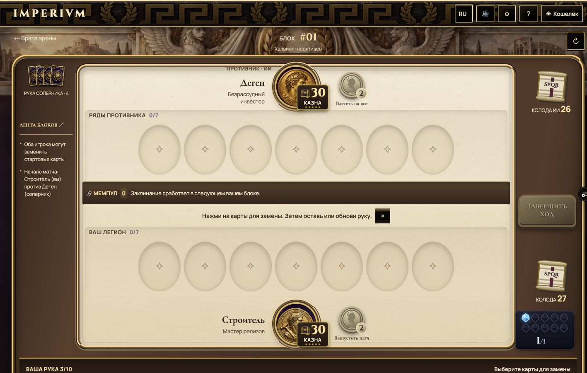
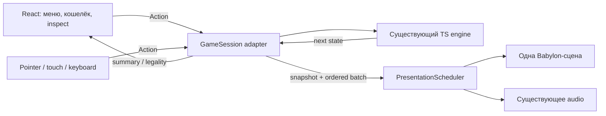

# Пересборка IMPERIVM: UX Hearthstone, собственный сеттинг

5 октября 2026. Аудит исходников `rebirth` на `8a712b7`, актуального Vercel и официальных материалов движков. Браузер — основная платформа. Главный UI/UX-референс — **игровой Hearthstone**; римский крипто-сеттинг, герои и механики IMPERIVM сохраняются. Есть возможность производить десятки собственных 3D-моделей.

## Решение

**Рекомендую Babylon.js для первого законченного фрагмента новой игры:** одна пространственная арена, одна камера, один canvas, существующая TypeScript-логика через адаптер. Next/React остаётся оболочкой для навигации, кошелька, коллекции и подробных окон. Внутри боя движок управляет объектами, вводом, ресурсами и анимациями.

Это выбор по соответствию задаче и готовым подсистемам, а не доказанное преимущество в FPS. Сравнительного прототипа Babylon/Three/PlayCanvas пока нет. Three/R3F уже способен отрисовать достойную сцену: проблема текущего проекта — композиция, производство ассетов и организация представления. Смена пакета сама по себе этих проблем не решит.

**Первый результат пересборки должен быть маленьким законченным боем, который выглядит и управляется как игра:** один стол, два героя, три типа карт, выбор цели, атака, заклинание, смерть и конец хода. Этот фрагмент проверяется визуально и на устройствах до переноса всех режимов.

## Что реально проверено

- `git pull --ff-only origin rebirth`: ветка обновлена до `8a712b7`, включая новые 3D-модели героев на главной.
- `npm run build`: exit 0; компиляция, типы и генерация маршрутов прошли. Для `/game` Next показал 86,1 kB маршрута и 246 kB First Load JS. Это показатель JS из отчёта сборки; он не включает всю позднюю загрузку моделей и текстур.
- `npm run smoke`: `SMOKE OK`, проверки контента и **61 regression groups passed**.
- В браузере изучены главная и бой на 1440×900. Также открыты официальный сайт HS, иллюстрация игрового поля и примеры взаимодействий Blizzard. Клиент Hearthstone в этом аудите не запускался; выводы о его внутренних технологиях ограничены опубликованными источниками.
- Проведена инвентаризация GLB, текстур, изображений и зависимостей. [Снимок данных и методика](audits/rendering-2026-10-05.json).

FPS, p95 времени кадра, фактические draw calls, сетевой waterfall и выделенная VRAM **не измерены**. Размер файла, число треугольников и оценка памяти текстур — разные показатели. Версия исходников зафиксирована; совпадение SHA исходников с текущим Vercel не проверялось.

## Почему текущий результат не достигает референса

### 1. Экран построен как длинная страница

На 1440×900 стартовый экран боя имеет высоту документа **1348 px**. Стол — **1062 px**, рука начинается на **y=863** и занимает **324 px**: игрок видит её заголовок, а карты находятся ниже экрана. После подтверждения руки документ всё ещё **1270 px**. Прокрутка к картам уводит верхнюю часть боя из вида.

Предыдущий проход увеличил текст и исправил локальные дефекты, но слишком увеличил вертикальные зоны. Такой компромисс не соответствует UX Hearthstone. Нужны разная плотность информации для руки, поля и подробного просмотра, а также композиция внутри доступного viewport.

### 2. Материалы не образуют игровое пространство

Борт, светлый центр, овальные слоты и тёмные полосы сделаны DOM/CSS. У них нет общей камеры, освещения, пересечений и контактных теней. Увеличение ridge-рамок даёт ступенчатую панель, но не ощущение предметного стола. Мемпул и подсказка делят центр на горизонтальные полосы; пустые ниши становятся главными объектами композиции.

В [официальном референсе поля HS](https://hearthstone.blizzard.com/en-us/news/23200870) центр относительно спокойный, а история мира находится в углах. Герои, способность, колоды и завершение хода встроены в силуэт стола. Для IMPERIVM нужна такая же иерархия: утопленный игровой центр, объёмный корпус и предметы по периферии. Это визуальное наблюдение, не утверждение о точном устройстве рендера HS.

### 3. Читаемость решается несистемно

В текущем бою встречаются подписи 11 px у руки противника, 12 px в истории и статусе халвинга, 13 px у способности и подсказки мемпула. Измерен вычисленный CSS, а не только найден старый размер в исходнике. Декоративный шрифт и фактура под текстом дополнительно ухудшают чтение.

Приоритет должен быть: **стоимость → атака/здоровье → название → правила в увеличенном просмотре**. В руке — узнаваемая карта; на поле — компактный медальон существа, большие числа и понятные состояния. Полный абзац правил не нужно ужимать внутрь маленькой фигуры. Blizzard описывает именно разделение состояний карты и приоритет чисел, названия и арта в [разборе Ben Thompson](https://hearthstone.blizzard.com/en-gb/news/13023802/hearthside-chat-art-with-ben-thompson-2-25-2014).

### 4. Модели добавлены как отдельные виджеты

Главная создаёт четыре `HeroModel3D` → `CoinPreview` → `Coin3D`. В браузере подтверждены четыре canvas. У каждого собственные renderer/context, свет и окружение; при видимом вращении — отдельный цикл кадров. Модели занимают примерно 104 CSS px, но суммарно содержат **341 622 треугольника**.

При этом уже сделаны полезные оптимизации: динамический импорт, IntersectionObserver, остановка вращения в скрытой вкладке, demand-режим при неактивности, reduced motion, fallback и Meshopt. Их следует сохранить. Проблема — стоимость ассетов и раздельные сцены при одновременном показе.

### 5. Представление связано с публикацией состояния боя

[`app/game/page.tsx`](../app/game/page.tsx) — 1035 строк: действия, AI, selection, drag, подтверждение владения, окна и FX находятся рядом. В `presentAction` результат `applyAction` при атаке помещается в `pendingCombat`; `setState(next)` вызывается из контакта анимации. Картинка определяет момент публикации игрового состояния.

Есть одновременно `diffBattleFx`, `diffAction`, несколько оверлеев и таймеры отдельных эффектов. Это усложняет отмену, рестарт, синхронизацию удара/урона/смерти и будущую сеть. Сам по себе `setTimeout` не является дефектом; не хватает единой очереди представления с понятным временем и жизненным циклом.

Хорошая основа уже есть: [`lib/engine/engine.ts`](../lib/engine/engine.ts) содержит независимые `createGame`, `legalActions`, `applyAction`; переходы иммутабельны. `legalActions` в UI уже мемоизирован по состоянию. [`lib/events.ts`](../lib/events.ts) предоставляет структурированные события. Переписывать правила ради новой графики не требуется.

### 6. Не сформирован единый художественный стандарт

Живописный арт, золотые монеты, светлый мрамор, CSS-градиенты и разные рамки используют разные способы изображения света и деталей. Даже идеально быстрый движок покажет эту несогласованность.

Нужны общий ракурс, масштаб деталей, палитра, направление света и правила материалов. Герои должны различаться силуэтом и лицом, а не только подписью под золотым диском. Монеты хорошо подходят для наград и способности; для главных героев стоит испытать выразительные портреты в объёмных римских обрамлениях.

## Реальная стоимость ассетов

Треугольники ниже посчитаны по accessor индексов triangle-list в GLB; это геометрия исходных файлов, не счётчик GPU кадра.

| Модель героя | Размер GLB | Треугольники |
| --- | ---: | ---: |
| Кит | 2 832 516 B | 118 534 |
| Строитель | 831 808 B | 68 330 |
| Деген | 983 364 B | 78 642 |
| Валидатор | 955 592 B | 76 116 |
| Всего | **5 603 280 B / 5,34 MiB** | **341 622** |

У четырёх героев 12 встроенных изображений 1024×1024. При условном RGBA8 это **48 MiB базовых уровней**, около **64 MiB с полной mip-цепочкой**. Это расчётный сценарий, не измерение VRAM; он не включает геометрию, окружение и framebuffer.

Все 16 GLB уже используют `EXT_meshopt_compression` и `KHR_mesh_quantization`. Некоторые используют WebP. `KHR_texture_basisu`/KTX2 отсутствует. Meshopt уменьшает передачу геометрии, но не превращает 118 тысяч треугольников в 5 тысяч. JPEG/PNG/WebP уменьшают файл, но не равнозначны сжатию текстуры в GPU. Различие и поддержку KTX2 описывает [документация Babylon](https://github.com/BabylonJS/Documentation/blob/master/content/features/featuresDeepDive/materials/using/ktx2Compression.md).

В каталоге также есть газовый кристалл на 138 478 треугольников и декор примерно на 76–139 тысяч каждый. Это риск при массовом использовании этих файлов; **нынешняя мана не рендерит десять таких GLB**.

Инвентарь каталогов: models — 25,57 MiB, cards — 13,46 MiB, ui — 6,62 MiB. Это наличие файлов, не доказанная загрузка всех файлов одним маршрутом. На экране рубашка 1280×1920 используется примерно в 35×50 px, арт 1024×1536 — примерно в 131×87 px. Требуются варианты разрешения и загрузка подробного арта по запросу.

## Сравнение движков и готовых основ

Оценки ниже качественные; одинаковая сцена на разных движках пока не измерялась.

| Вариант | Готовые возможности и соответствие | Цена перехода / вывод |
| --- | --- | --- |
| **Babylon.js** | 3D-сцена, PBR, picking, анимации, частицы, GUI, glTF, инструменты редактирования и диагностики. | Сохраняет JS/TS и браузерные интеграции. Переносится слой представления. **Основной кандидат для прототипа.** |
| **PlayCanvas** | Полноценный браузерный 3D-движок, ECS, ресурсы, UI, свет и анимации; визуальный Editor и React-интеграция. | Сильная альтернатива, особенно если художник будет непосредственно собирать сцену в Editor. Нужно заранее выбрать кодовый или редакторский процесс и проверить экспорт в нашу оболочку. |
| **Three + R3F + Drei** | Уже установлен; сцена и материалы достаточны. Есть demand rendering, instancing, LOD и кеширование. | Минимум миграции зависимостей, но игровой scheduler, GUI, asset lifecycle и инструменты приходится собирать более явно. **Резерв, если Babylon-прототип не оправдает переход.** |
| **Phaser** | Готовые 2D-сцены, input, tweens, loader; официальный шаблон Next/React bridge. | Хорош для нарисованной 2,5D-арены со спрайтами. Для десятков настоящих 3D-моделей и общего света потребует отдельного решения. Не основной путь при текущем запросе. |
| **PixiJS** | Производительный 2D-рендер, batching, atlas, bitmap text. | Подходит для дорогой на вид нарисованной карточной игры. Это рендерер, а не готовый набор игровых подсистем; пространственную арену придётся имитировать. |
| **Shipow/react-hearthstone** | React-компоненты галереи, списка карт и сборки колоды с привычной иерархией стоимости/названия/количества. | Полезный дополнительный референс коллекции и deck builder. Боевой сцены, 3D-рендера, атаки и очереди эффектов в нём нет. Требует переработки под современный React и наши данные. |
| **Unity Web** | Полный редактор и игровой стек; исторически использовался Hearthstone. | Браузерный экспорт возможен, в том числе на поддерживаемых мобильных браузерах. Но появляются C#/WASM, новый build pipeline и мост к кошельку/TS. Для текущего браузерного проекта стоимость выше. |
| **Godot Web** | Открытый полноценный редактор, сцены и анимации. | Web использует Compatibility/WebGL2; есть ограничения экспорта и интеграции. Потребуется перенос или мост существующих TS-правил. Для данного проекта уступает прямому JS-пути. |

Основания: [Babylon specifications](https://www.babylonjs.com/specifications/), [PlayCanvas Engine](https://dev.playcanvas.com/products/engine), [PlayCanvas React](https://developer.playcanvas.com/user-manual/react/), [R3F performance](https://r3f.docs.pmnd.rs/advanced/scaling-performance), [Pixi performance](https://pixijs.com/8.x/guides/concepts/performance-tips), [Phaser Next template](https://github.com/phaserjs/template-nextjs), [Unity browser compatibility](https://docs.unity3d.com/6000.0/Documentation/Manual/webgl-browsercompatibility.html), [Godot Web export](https://docs.godotengine.org/en/stable/tutorials/export/exporting_for_web.html).

### Что можно взять почти готовым

1. **Babylon-подсистемы:** glTF loader, общий материал/геометрия, picking, AnimationGroup, SpriteManager/частицы, GUI, Inspector. Собственная работа концентрируется на композиции и правилах представления карточного боя, а не на написании renderer.
2. **React ↔ game bridge из официального Phaser-шаблона:** полезный образец границы между приложением и сценой. Шаблон сейчас использует Phaser 4 и Next 15.3.1, а у нас Next 14/App Router; копировать проект целиком поверх нашего нельзя. Используем архитектурный принцип, без его сборочных скриптов.
3. **Open Duelyst как реальный открытый пример карточной игры:** в [GameLayer](https://github.com/open-duelyst/duelyst/blob/main/app/view/layers/game/GameLayer.js) видны очередь шагов/действий, отдельные visual state, объекты inspection и разделение FX/no-FX слоёв. [Репозиторий](https://github.com/open-duelyst/duelyst) опубликован с CC0, но стек старый (Cocos, Backbone, CoffeeScript и инфраструктура Firebase). Это источник проверяемых паттернов, не готовая замена нашего приложения.
4. **glTF Transform:** готовые inspect, simplify, resize, dedup, Meshopt и преобразование текстур в KTX2. Нужен воспроизводимый pipeline, а не ручная обработка каждой модели. [Официальный CLI](https://gltf-transform.dev/cli).
5. **[Shipow/react-hearthstone](https://github.com/Shipow/react-hearthstone)**, добавлен по указанию пользователя: конкретные паттерны галереи, списка колоды и добавления/удаления карт. Применение — React-оболочка коллекции; решение о движке боя от этого не меняется.

`boardgame.io` занимается правилами/ходами и не даст графику HS; наша логика уже работает. `Colyseus` решает серверные комнаты/синхронизацию, а не качество интерфейса; его выбор относится к отдельной сетевой задаче. Установка множества библиотек не заменяет эти границы.

### Отдельная проверка react-hearthstone

Проверен `Shipow/react-hearthstone` на `a8e6d43` (последний commit — 28.04.2016, версия в репозитории 0.4.2). README помечает проект WIP и указывает MIT; `package.json` также объявляет MIT, отдельного файла LICENSE в корне нет. Репозиторий не отмечен archived. История давно не обновлялась; поддержка современных браузеров/React этим аудитом не доказана. [README](https://github.com/Shipow/react-hearthstone), [package.json](https://github.com/Shipow/react-hearthstone/blob/master/package.json).

**Полезное для нашей коллекции:**

- [CardList](https://github.com/Shipow/react-hearthstone/blob/master/components/CardList.js) группирует повторы по ID и сортирует по стоимости/названию; [CardListItem](https://github.com/Shipow/react-hearthstone/blob/master/components/CardListItem.js) выделяет стоимость, название и число копий. Это хороший компактный список выбранной колоды.
- [CardGallery](https://github.com/Shipow/react-hearthstone/blob/master/components/CardGallery.js) использует placeholder и отложенный показ карточек; [CardGalleryItem](https://github.com/Shipow/react-hearthstone/blob/master/components/CardGalleryItem.js) отображает готовую картинку карты. Переносим принцип стабильных размеров и загрузки по видимости на наши варианты арта.
- [DeckBuilder](https://github.com/Shipow/react-hearthstone/blob/master/components/DeckBuilder.js) связывает выбор из галереи с добавлением/удалением из списка, ограничением размера и дубликатов. В IMPERIVM ограничения должны приходить из существующих правил и владения картами.

**Стоимость прямого подключения:** peer dependencies требуют React 15 и jQuery 2; используются `React.PropTypes`, Webpack 1/Babel 6 и git-зависимость `react-lazyload`. У нас React 18/Next 14. `DeckBuilder` самостоятельно загружает HearthstoneJSON и формирует HTTP-ссылки на чужой арт. Данные и изображения нужно заменить локальным адаптером IMPERIVM. Это не проверенный drop-in пакет для нашего проекта.

Есть и конкретные дефекты для учёта: `CardGallery` сортирует переданный массив через `.sort()`, изменяя props; `DeckBuilder` содержит опечатку `componentWillUmount`, из-за которой отмена запроса не подключается к обычному lifecycle. Кликабельные `li`/`a` нуждаются в современных кнопках и keyboard-управлении. Эти детали следует исправить при адаптации, а не наследовать.

**Вывод:** брать UX-паттерны коллекции и чисто переписать нужные небольшие компоненты на наших типах/данных. В бою использовать выбранный renderer и собственный PresentationScheduler. Лицензия кода не делает арт Blizzard частью нашего сеттинга.

## Стек первого фрагмента

| Часть | Решение |
| --- | --- |
| Рендер | `@babylonjs/core`, один WebGL2 canvas; WebGPU можно проверить позже как дополнительный путь. |
| Ресурсы | `@babylonjs/loaders`, glTF/GLB, локальные версии декодеров Meshopt/KTX2; загрузка по manifest. |
| Игровые подписи | Общий GUI-слой `@babylonjs/gui`; подробные правила в доступном React-окне. При проблемах масштаба текста отдельно проверить MSDF. |
| Анимации | AnimationGroup + единый PresentationScheduler; короткие заранее подготовленные последовательности. |
| Отладка | Inspector только в dev; Scene/EngineInstrumentation в режиме профилирования. |
| Арт | Blender/эквивалент → GLB + baked textures → glTF Transform; atlas рамок, иконок и состояний. |
| Правила | Существующий `lib/engine`, cards, heroes, decks, AI, events. |
| Аудио | Существующий `lib/audio`; синхронизация с событиями scheduler. Новая звуковая библиотека пока не обязательна. |
| Оболочка | Существующий Next/React, локализация, кошелёк, коллекция, окна. |

ES-модули Babylon допускают tree shaking: импортировать нужные модули и glTF-регистрацию, а не общий namespace со всеми возможностями. Измерить итоговый lazy chunk после production build. Пакеты core/loaders/gui должны иметь согласованные версии. [Официальная схема пакетов](https://github.com/BabylonJS/Documentation/blob/master/content/setup/frameworkPackages/es6Support.md).

В прототипе не нужны physics, navmesh, скелет у каждой карты и тяжёлая цепочка полноэкранной постобработки. Объём даётся геометрией, светом и авторскими текстурами. При отсутствии WebGL2 — понятный экран совместимости; не обещаем поддержку любого браузера.

## Архитектура представления

**Два состояния:** актуальное состояние правил и показанное состояние. Проверенное действие сразу обновляет первое; второе проходит через последовательность «подготовка → движение → контакт → числа → смерть → перестроение ряда». Следующее действие блокируется или ставится в очередь политикой ввода, а не отсутствием `setState` до окончания картинки.

Каждый batch получает `matchId`, `actionId`, `revision`, исходный/конечный snapshot и стабильные UID объектов. Для старта можно адаптировать существующий `diffAction`. Его агрегированные события нельзя считать точным журналом порядка всех внутренних эффектов: случаи с несколькими разрешениями заклинаний нужно проверить отдельно. Если нужен более точный поток, контракт согласуется с владельцем `lib/`, не правится здесь самовольно.

Scheduler имеет единое время, cancel/reset/fast-forward, синхронизацию звука и уничтожение ресурсов. Reduced motion сокращает движение, сохраняя причинность и конечное состояние. Рестарт отменяет старые batches, callbacks и pending assets. Повтор события с тем же ID не создаёт второй эффект.

Компонент React монтирует/уничтожает renderer один раз. Hover, перетаскивание и кадры не обновляют весь React-tree. picking ограничен активными hit-поверхностями карт/героев/кнопок; декор не участвует в постоянном поиске цели. Статичные материалы и геометрия переиспользуются. [Диагностика и оптимизации Babylon](https://github.com/BabylonJS/Documentation/blob/master/content/features/featuresDeepDive/scene/optimize_your_scene.md).

## Конкретный UI/UX-контракт с Hearthstone

| Ситуация | Требуемое поведение IMPERIVM |
| --- | --- |
| Обычный бой | Оба героя, оба ряда, рука, газ и завершение хода одновременно доступны в одном viewport. История и кошелёк не занимают центральное поле. |
| Карта в руке | Веер в нижней части стола; стоимость и название читаются. Hover поднимает карту и показывает увеличенный просмотр. На телефоне tap открывает просмотр с явным действием. |
| Существо на поле | Медальон/фигура с крупными attack/health, силуэтом, понятными shield/taunt/exhausted. Правила доступны через inspection. |
| Розыгрыш | Карта остаётся под указателем, допустимые зоны проявляются во время drag, отмена возвращает её в руку. Невалидный drop не расходует ресурс. |
| Выбор цели | Чёткая линия от источника и одинаковая подсветка допустимых целей. Цель различима формой/обводкой, а не только цветом. |
| Атака | Подготовка, короткое движение, контакт, синхронные звук/числа, затем смерть и перестановка. UI не ждёт окончания необязательных искр для следующего действия. |
| Мемпул | Собственная механика IMPERIVM: компактный физический канал/свитки между сторонами; порядок и время разрешения читаются. Развёрнутое объяснение — по запросу. |
| Халвинг | Крупное событие только при активации; постоянный статус компактный и находится у счётчика блока. |
| Завершение хода | Постоянное место справа от поля, контрастное состояние, понятный disabled и короткий переход сторон. |
| Герои | Стабильные места сверху/снизу, обе идентичности всегда присутствуют. Казна и способность не перекрывают лицо и друг друга. |

В [разборе эффектов HS](https://hearthstone.blizzard.com/en-us/news/22552047) Blizzard связывает эффекты с информацией, допустимыми целями и характером класса. Для нас это означает отдельную палитру/формы эффектов Кит/Строитель/Деген/Валидатор и сдержанные повседневные действия. Большая вспышка должна соответствовать большому игровому событию.

**Текст:** управляющие подписи и подробные правила преимущественно 14–16 экранных px; стоимость и характеристики 22–30 px на настольном контрольном экране. Для телефона размеры проверяются на реальном устройстве, а не вычисляются уменьшением всего canvas. Декоративный serif — для коротких заголовков, кириллический sans — для правил. Цель контраста обычного текста ≥4,5:1 на фактическом фоне; цифры остаются чёткими при эффектах и в RU/EN.

**Адаптация:** desktop/tablet landscape — цельный стол; на узком portrait — более тесная композиция и выдвижная увеличенная карта, без прокрутки документа между рукой и целью. Горизонтальный выбор внутри руки допустим. Поле и управление не превращаются в длинную страницу. Touch-зоны — минимум 44 px в нашем контракте. Вне canvas остаются keyboard-альтернатива доступным действиям и доступные текстовые окна.

## Бриф для десятков собственных 3D-моделей

Количество файлов не является главным ограничением. Важны **одновременно видимые** геометрия, материалы, прозрачность и текстуры. Можно иметь большую библиотеку, загружая только выбранный стол и нужных героев. Повторные объекты используют общую геометрию/материалы и instances.

### Первый набор для одной арены

| Ассет | Задача | Начальный ориентир геометрии для игровой версии |
| --- | --- | ---: |
| Корпус римского стола | Толщина, фаски, ножки/силуэт, бронзовая кромка | 10–20k треугольников |
| Утопленный игровой центр | Спокойная поверхность, швы, мягкая глубина | 2–5k |
| Четыре угловые композиции | Казна/монеты, акведук, форум, жаровня; история сеттинга | 2–5k на композицию |
| Обрамления двух героев | Единая форма, место для лица и казны | 2–5k на рамку |
| Жетоны способности | Отличимые силуэты; основная детализация запечена | 1–3k на жетон |
| Держатели колоды, кнопка хода | Физическая принадлежность столу | 1–3k на предмет |
| Газовые кристаллы | Общая геометрия, instances, без тяжёлой refraction | 200–800 на кристалл |
| Мемпул | Канал/свитки и ясные точки очереди | 1–3k на базовый объект |
| Карты/фигуры существ | Плоскости арта + простая рамка, общий atlas | 100–500 на фигуру |

Эти числа — стартовые бюджеты, а не гарантия FPS. Карта существа не обязана иметь полноценного анимированного 3D-персонажа: выразительный арт в объёмной фигуре экономит ресурсы и соответствует выбранному UX. Более сложные герои можно испытать отдельно, сохранив видимость лица с игровой камеры.

### Правила передачи моделей

- GLB/glTF 2.0, согласованные единицы/масштаб, ориентация, pivot и ось «вверх» в manifest; применение transforms до экспорта. Исходник высокого качества хранится отдельно от web-версии.
- Модель оценивается **с фиксированной игровой камеры**. Силуэт и крупные фаски важнее деталей, которые исчезают на 80–150 экранных px. Общий тёплый свет сверху слева; корректные normals, UV, отсутствие лишних внутренних поверхностей.
- Один общий PBR metallic/roughness-процесс: бронза, камень, дерево с согласованными roughness/цветом. Материал по возможности общий, а не уникальный shader на каждый объект. Без ненужных transmission/volume-расширений и дорогой прозрачности.
- Текстуры небольшого декора обычно 256–512, большие поверхности 1024 как старт; использовать atlas. Не назначать каждому маленькому предмету три карты 1024×1024 по умолчанию.
- Запекать high-poly детали, AO и часть статичного освещения. Low-poly сохраняет силуэт; normal map сохраняет резьбу. Подготавливать LOD для объектов, у которых меняется экранный размер; для фиксированной камеры часто достаточно одной правильно облегчённой версии.
- KTX2: ETC1S испытать для цветовых карт, UASTC — для normal/data, качество проверить рядом с исходником. Нормали, металличность и roughness должны сохранять корректное цветовое пространство. Мелкие иконки/буквы не сжимать до потери читаемости.
- Общий pipeline: `inspect → очистка/dedup → simplify/retopology → bake → resize → KTX2 → Meshopt → validate`. Порядок и профиль фиксируются скриптом после первого ассета; повторный экспорт даёт проверяемый manifest с байтами, triangles, материалами и размерами текстур.
- У каждого ассета: идентификатор, назначение, источник/права, preview из игровой камеры, варианты качества и статистика. Игровая сборка получает готовые версии, без исходных high-poly файлов.

Для текущих монет разумно испытать снижение до 2–5k треугольников с запечённой резьбой. Переход не делается «слепым» процентом simplify: сначала сравнение силуэта и лица на реальном размере.

## Критерии принятия прототипа

Это **цели для измерений**, не достигнутые показатели нынешней игры.

| Проверка | Первоначальный порог |
| --- | --- |
| Композиция | На 1440×900 и 1280×720 рука, два ряда, герои и завершение хода доступны без прокрутки страницы. На телефоне нет необходимости скроллить от выбранной карты к цели. |
| Контроль качества | Пустой стол, 7×7 существ, рука 10 карт, подробный просмотр, выбор цели и смерть сравниваются с UX HS; собственный арт и механики сохраняются. |
| Отзывчивость | Видимый отклик выбора/drag на следующий доступный кадр; необязательные FX не блокируют ввод. |
| Частота кадров | Цель desktop 60 FPS; для среднего телефона минимум стабильные 30 FPS, стремиться к 60. В нагрузочном сценарии p95 времени кадра ≤20 ms desktop / ≤33 ms mobile. |
| Рендер | Один WebGL context для матча. Начальная цель ≤100 draw calls и ≤150–250k видимых треугольников на мобильном профиле; пересмотреть по измерениям. |
| Текстуры | Начальная цель ≤64 MiB GPU-текстур для мобильной сцены; измерить доступным инструментом или явно обозначить расчётный способ. |
| Загрузка | Начальная цель ≤4 MiB сжатых критических ресурсов сцены/движка, отдельно от общей оболочки и кошелька. Водопад загрузки фиксируется; декор и подробный арт догружаются. |
| Простой | Скрытая вкладка останавливает цикл; неподвижная сцена без эффектов перерисовывается по изменениям. Ambient-анимации имеют ограниченный режим качества. |
| Жизненный цикл | 50 рестартов без накопления объектов/подписок; восстановление контекста и прерванная загрузка не теряют состояние матча. |
| Корректность | Действия прототипа дают то же состояние, что существующий engine; отмена drag, двойной ввод и fast-forward FX не расходуют ресурсы дважды. |

Измерять production build с одним и тем же seed/сценарием: 7×7 существ, 10 карт, очередь заклинаний, массовый урон, Rug, халвинг, уничтожение и повторный матч. Нужны реальный Android среднего класса, iPhone/Safari и desktop. Эмуляция ширины проверяет раскладку, но не доказывает мобильную производительность. GPU timing доступен не на всех устройствах — отсутствие счётчика не записывать как ноль.

## Порядок пересборки и границы параллельной работы

1. **Зафиксировать художественный эталон одной сцены:** ракурс, спокойный центр, четыре угла, два героя, рука и состояния. Использовать существующий арт, заменить только неподходящие ключевые ассеты. Скриншот пустого и заполненного стола — первый критерий.
2. **Собрать отдельный клиентский прототип** в новых presentation-компонентах, с демо-состоянием и затем read-only импортом существующего engine. Предлагаемый маршрут `/arena-lab`; текущий `/game` сохраняется до принятия нового поведения. Проверить SSR/lazy loading и dispose при повторном mount.
3. **Проверить готовые подсистемы:** один ввод, общий GUI, очередь атаки/урона/смерти, atlas, KTX2/Meshopt, два профиля качества. Измерить bundle, сеть, frame time и память. Если переход Babylon не даёт пользы по готовности систем, тот же контракт реализуется на одном существующем R3F canvas.
4. **Подключить все механики:** мемпул, героя, халвинг, Rug, замену руки, результат. Сравнить состояния с engine, проверить порядок сложных событий. Серверный владелец согласует изменения контрактов `lib/` при необходимости.
5. **Перенести готовое представление в `/game` совместно с серверным Codex**, затем привести `/arena` и главную к той же художественной системе. Удалять старые battle CSS/DOM только после замены и проверок.

По `docs/CODEX_COORDINATION.md` `app/game/`, `lib/`, `CardView.tsx`, `card-frames.css`, `ManaCrystals.tsx`, `README.md` принадлежат серверной работе. В этом аудите они только прочитаны. Изменены документы аудита и доказательства; игровые файлы, зависимости и публичное поведение не менялись. Предложения о переносе этих частей — план координации, а не уже выполненные правки.

## Совместимость зависимостей на 05.10.2026

Версии — снимок официального npm registry, не команда обновления. [Полные peer dependencies и даты](audits/rendering-2026-10-05.json).

| Пакет | Текущий latest | Что влияет на решение |
| --- | --- | --- |
| `@babylonjs/core` | 9.29.0 | Apache-2.0; main engine для прототипа. Согласовать loaders/gui по версии. |
| `playcanvas` | 2.23.0 | MIT; полноценная альтернатива. |
| `three` | 0.186.1 | MIT; в проекте 0.170.0. Обновление требует проверки, не является исправлением дизайна. |
| `@react-three/fiber` | 9.8.1 | React ≥19; у нас 8.18.0 и React 18.3. Не обновлять отдельно до latest. |
| `@react-three/drei` | 10.7.9 | React 19 и R3F 9; у нас 9.122.0. |
| `phaser` | 4.2.1 | MIT; актуальный официальный шаблон уже Phaser 4. |
| `pixi.js` / `@pixi/react` | 8.22.0 / 8.0.5 | MIT; React-wrapper требует React ≥19. Vanilla Pixi можно подключать отдельно. |
| `@gltf-transform/cli` | 4.5.1 | MIT; Node ≥20; версия уже указана в generator текущих GLB. |
| `boardgame.io` | 0.50.2 | Последняя публикация npm 10.11.2022; дополнительный повод не менять работающие правила на этот пакет ради графики. |
| `colyseus` | 0.18.9 | MIT; Node ≥22, сервер комнат. К renderer не относится. |

Первичный источник версий: `https://registry.npmjs.org/<package>`; для scope-пакетов scope и имя передаются как путь пакета. Лицензия движка не заменяет проверку прав на отдельные модели и текстуры.

Историческое использование Unity командой HS подтверждено [материалом Unity](https://unity3d.com/files/solutions/unityformobile/A_Guide_To_Moving_From_Internal_Game_Engine_Technology.pdf). Полезный производственный урок оттуда — быстрые художественные итерации и возможность художникам собирать события/анимации. Это не основание переносить браузерный TS-проект на Unity только ради названия движка.

## Реализованный срез, 05.10.2026

Новое тренировочное представление доступно в `/arena-lab`; вход с выбора героя в `/arena`. Реализованы горизонтальная и вертикальная композиции, подготовлены все 21 GLB, анимации привязаны к существующим правилам. Сетевой `/game` и кошелёк ещё не перенесены. Первоначальный аудит выше описывает исходный проект; текущие браузерные замеры и их ограничения — [performance-review.md](performance-review.md). Поведение, сравнение с просмотренным геймплеем Hearthstone и требования к ассетам — [motion-direction.md](motion-direction.md).
